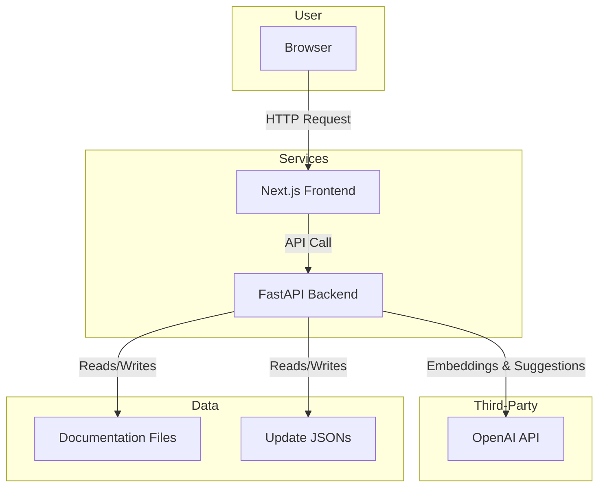

# AI-Powered Documentation Update Tool

An intelligent tool that uses natural language to find and update technical documentation, ensuring your content stays accurate and up-to-date with minimal effort.

---

## The Problem

Information changes fast. For any software product, keeping documentation in sync with new features, deprecations, and best practices is a constant challenge. Manually finding every place that needs an update is tedious, error-prone, and time-consuming.

This project solves that problem. It allows a user to describe a change in plain English, and the AI will find all relevant sections in the documentation and suggest precise updates.

## Key Features

-   **Natural Language Queries**: Simply describe a change (e.g., "We deprecated the `as_tool` feature, agents must use `handoff` instead").
-   **AI-Powered Semantic Search**: Uses OpenAI embeddings to find documentation sections that are *conceptually related* to the query, not just keyword matches.
-   **Intelligent Suggestions**: An AI agent analyzes the relevant sections and generates precise update suggestions, showing the original text and the proposed change.
-   **Interactive Review & Approval**: A clean web interface where users can review each suggestion, approve the ones they like, and reject the others.
-   **Automated Updates**: Approved suggestions are automatically applied to the source documentation files.
-   **Robust Matching**: A multi-tiered matching system (exact, normalized, and fuzzy) ensures that AI-generated suggestions can be reliably located and replaced in the source files.

## Tech Stack

-   **Frontend**: Next.js, React, TypeScript, Tailwind CSS
-   **Backend**: FastAPI, Python, Pydantic
-   **AI**: OpenAI API (`gpt-4o-mini` for suggestions, `text-embedding-ada-002` for semantic search)
-   **Storage**: JSON files for managing pending and applied updates.
-   **Tooling**: Docker & Docker Compose for easy, reproducible setup.

## Architecture Overview

The application consists of a Next.js frontend and a FastAPI backend.



1.  The user interacts with the **Next.js Frontend**.
2.  The frontend sends the user's query to the **FastAPI Backend**.
3.  The backend:
    a.  Uses the **OpenAI API** to create an embedding of the user's query.
    b.  Compares this embedding against pre-computed embeddings of the **Documentation Files** to find relevant sections.
    c.  Sends the relevant sections and the query to the **OpenAI API** to generate update suggestions.
    d.  Saves these suggestions to **JSON files** for review.
4.  The user reviews, approves, or rejects suggestions, and approved changes are written back to the documentation files.

---

## AI Workflow Overview

When a user submits a query describing a documentation change, the following workflow is triggered:

1. **Semantic Search:**
   - The backend uses OpenAI's embedding model to convert the user's query into a vector.
   - This vector is compared to pre-computed embeddings of documentation sections to find the most relevant content, even if the wording is different.
2. **AI Suggestion Generation:**
   - The relevant documentation sections and the user's query are sent to OpenAI's GPT-4o-mini model.
   - The model generates precise update suggestions, showing both the original and proposed new text.
3. **Review & Approval:**
   - Suggestions are presented in the frontend for user review.
   - Users can approve or reject each suggestion.
4. **Automated Update:**
   - Approved suggestions are automatically applied to the source documentation files.

**Why GPT-4o-mini?**
- We use GPT-4o-mini because it offers a strong balance between quality and speed. It is capable of producing high-quality suggestions for documentation updates while maintaining low latency, making the user experience smooth and responsive.

## Getting Started

### Prerequisites

-   Git
-   Python 3.10+
-   Node.js (v18+) & npm or pnpm
-   An OpenAI API Key

### 1. Clone the repository

```bash
git clone https://github.com/hungryc8rpillar/doc-update-tool.git
cd doc-update-tool
```

### 2. Set up environment variables
Copy the example environment file and fill in your OpenAI API key:
  ```bash
  cp .env.example .env
  ```

**Note:**
The application expects a folder called `documentation` inside the `data` directory (i.e., `data/documentation/`).
You must provide your own documentation files in this folder for the tool to analyze and update. These files are not included in the repository.

### 3. Install and run the **backend** (FastAPI)

```bash
cd fastapi_backend
python -m venv .venv
source .venv/bin/activate  # On Windows: .venv\Scripts\activate
pip install -r requirements.txt
uv run fastapi dev app/main.py --host 0.0.0.0 --port 8000 --reload
```
- The backend will be available at [http://localhost:8000/docs](http://localhost:8000/docs).

### 4. Install and run the **frontend** (Next.js)

```bash
cd ../nextjs-frontend
npm install  # or pnpm install
npm run dev  # or pnpm dev
```
- The frontend will be available at [http://localhost:3000](http://localhost:3000).

### 5. Access the application

- **Frontend (Web App):** [http://localhost:3000](http://localhost:3000)
- **Backend (API Docs):** [http://localhost:8000/docs](http://localhost:8000/docs)

## Usage

1.  Open the web application at [http://localhost:3000](http://localhost:3000).
2.  In the text area, enter a natural language query describing a documentation change.
3.  Click "Analyze & Generate Suggestions".
4.  The AI will analyze the documentation and present you with a list of suggested updates.
5.  Navigate to the "Review & Approve" page to see pending suggestions.
6.  Review each suggestion and click "Approve" or "Reject".
7.  Approved changes will be automatically saved to the documentation files located in the `data/documentation` directory.

### Current Limitations

- Single-user system; no concurrent user support.
- File-based storage; not suitable for high-volume usage.
- Simple AI prompting; no advanced RAG techniques.
- Limited error recovery; basic retry mechanisms only.
- No user authentication; all changes are anonymous.
- Synchronous processing; AI calls block the UI.

---

## Tradeoffs and Fast Implementation Decisions

### 🗄️ Data Storage & Persistence
- **What we did:** Used JSON file storage in `data/updates/` for all data.
- **Why:** Allowed rapid development without database setup, migrations, or ORM configuration.
- **Production approach:** Use PostgreSQL/MongoDB with proper schemas, foreign keys, connection pooling, transaction management, and backup procedures.

### 🔐 Authentication & User Management
- **What we did:** No authentication system; anonymous usage.
- **Why:** Authentication adds complexity without demonstrating core AI functionality.
- **Production approach:** JWT auth, role-based access, user sessions, audit trails, and API key management.

### 🧠 AI Implementation Strategy
- **What we did:** Direct OpenAI API calls with simple prompting.
- **Why:** Simple prompting gets 80% of the functionality with 20% of the complexity.
- **Production approach:** RAG with vector embeddings, chunking, vector database (Pinecone/Weaviate), and multiple model support.

### 🔍 Document Processing
- **What we did:** Basic JSON parsing with simple text extraction.
- **Why:** Sufficient for demo and workflow demonstration.
- **Production approach:** Advanced markdown parsing, code block detection, cross-reference detection, and support for multiple formats.

### 🔄 State Management (Frontend)
- **What we did:** In-memory state with React hooks (`useState`, `useEffect`).
- **Why:** Adequate for demo scope.
- **Production approach:** Redux Toolkit or Zustand, server-side sessions, optimistic updates, offline support.

### 🚨 Error Handling & Monitoring
- **What we did:** Basic try/catch, console logging, simple error boundaries.
- **Why:** To focus on core features and keep code short.
- **Production approach:** Structured logging, APM, error tracking (Sentry/Rollbar), health checks, circuit breakers.

### 🏗️ API Design & Validation
- **What we did:** Simple Pydantic models with basic validation.
- **Why:** Focused on functionality over API robustness.
- **Production approach:** Comprehensive validation, API versioning, rate limiting, request/response caching, and detailed OpenAPI docs.

### 🧪 Testing Strategy
- **What we did:** Manual testing only.
- **Why:** Test-driven development would have slowed feature development for a demo.
- **Production approach:** Unit, integration, E2E, and performance tests.

### 🔒 Security Considerations
- **What we did:** Basic CORS, no advanced security.
- **Why:** Security hardening wasn't necessary for a controlled demo.
- **Production approach:** Input sanitization, API key management, request signing, CSP, and regular audits.

### 📊 Performance & Scalability
- **What we did:** Single FastAPI instance, synchronous processing, blocking AI calls.
- **Why:** Performance optimization would require infrastructure setup and load testing.
- **Production approach:** Async/await, background jobs, horizontal scaling, CDN, and query optimization.

### 📝 Documentation & Code Comments
- **What we did:** Minimal inline documentation and comments.
- **Why:** To move quickly and keep files short.
- **Production approach:** Add docstrings, inline comments, and more detailed documentation.

---

## Future Improvements

- **Multi-user support with authentication:** Add user registration, login, and role-based permissions.
- **Database integration:** Migrate from file-based storage to a scalable database (e.g., PostgreSQL) for reliability and performance.
- **Advanced AI features:** Integrate vector databases and more sophisticated retrieval-augmented generation (RAG) for better semantic search and context.
- **Background processing:** Support large documentation sets and long-running tasks with background jobs.
- **Comprehensive testing:** Implement unit, integration, and end-to-end tests for both backend and frontend.
- **Production deployment:** Add scripts and configuration for robust, secure, and scalable deployment.
- **Embedding caching:** Cache documentation embeddings to reduce latency and API costs on subsequent queries.
- **Support for more documentation formats:** Enable updates to Markdown and other formats, not just JSON.
- **User attribution and audit trails:** Track who made which changes for accountability.
- **CI/CD pipeline:** Automate testing and deployment to cloud environments.
