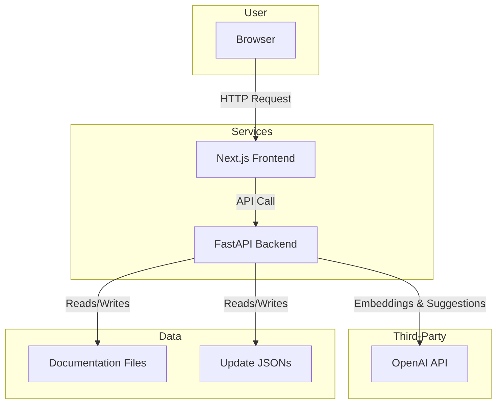

# AI-Powered Documentation Update Tool

An intelligent tool that uses natural language to find and update technical documentation, ensuring your content stays accurate and up-to-date with minimal effort.

---

## The Problem

Information changes fast. For any software product, keeping documentation in sync with new features, deprecations, and best practices is a constant challenge. Manually finding every place that needs an update is tedious, error-prone, and time-consuming.

This project solves that problem. It allows a user to describe a change in plain English, and the AI will find all relevant sections in the documentation and suggest precise updates.

## Key Features

-   **Natural Language Queries**: Simply describe a change (e.g., "We deprecated the `as_tool` feature, agents must use `handoff` instead").
-   **AI-Powered Semantic Search**: Uses OpenAI embeddings to find documentation sections that are *conceptually related* to the query, not just keyword matches.
-   **Intelligent Suggestions**: An AI agent analyzes the relevant sections and generates precise update suggestions, showing the original text and the proposed change.
-   **Interactive Review & Approval**: A clean web interface where users can review each suggestion, approve the ones they like, and reject the others.
-   **Automated Updates**: Approved suggestions are automatically applied to the source documentation files.
-   **Robust Matching**: A multi-tiered matching system (exact, normalized, and fuzzy) ensures that AI-generated suggestions can be reliably located and replaced in the source files.

## Tech Stack

-   **Frontend**: Next.js, React, TypeScript, Tailwind CSS
-   **Backend**: FastAPI, Python, Pydantic
-   **AI**: OpenAI API (`gpt-4o-mini` for suggestions, `text-embedding-ada-002` for semantic search)
-   **Storage**: JSON files for managing pending and applied updates.
-   **Tooling**: Docker & Docker Compose for easy, reproducible setup.

## Architecture Overview

The application consists of a Next.js frontend and a FastAPI backend, orchestrated with Docker Compose.



1.  The user interacts with the **Next.js Frontend**.
2.  The frontend sends the user's query to the **FastAPI Backend**.
3.  The backend:
    a.  Uses the **OpenAI API** to create an embedding of the user's query.
    b.  Compares this embedding against pre-computed embeddings of the **Documentation Files** to find relevant sections.
    c.  Sends the relevant sections and the query to the **OpenAI API** to generate update suggestions.
    d.  Saves these suggestions to **JSON files** for review.
4.  The user reviews, approves, or rejects suggestions, and approved changes are written back to the documentation files.

## Getting Started

### Prerequisites

-   Git
-   Docker and Docker Compose
-   An OpenAI API Key

### Installation & Setup

1.  **Clone the repository:**
    ```bash
    git clone <your-repo-url>
    cd <your-repo-directory>
    ```

2.  **Create an environment file:**
    -   Copy the example environment file:
        ```bash
        cp .env.example .env
        ```
    -   Open the new `.env` file and add your OpenAI API key:
        ```
        OPENAI_API_KEY="sk-..."
        ```

3.  **Launch the application with Docker Compose:**
    ```bash
    docker-compose up --build
    ```
    This command will build the Docker images for the frontend and backend and start both services.

4.  **Access the application:**
    -   Frontend (Web App): [http://localhost:3000](http://localhost:3000)
    -   Backend (API Docs): [http://localhost:8000/docs](http://localhost:8000/docs)

## Usage

1.  Open the web application at [http://localhost:3000](http://localhost:3000).
2.  In the text area, enter a natural language query describing a documentation change.
3.  Click "Analyze & Generate Suggestions".
4.  The AI will analyze the documentation and present you with a list of suggested updates.
5.  Navigate to the "Review & Approve" page to see pending suggestions.
6.  Review each suggestion and click "Approve" or "Reject".
7.  Approved changes will be automatically saved to the documentation files located in the `data/documentation` directory.

## Future Improvements

-   **Database Integration**: Replace the JSON file storage with a proper database (e.g., PostgreSQL) for better scalability and management of updates.
-   **Embedding Caching**: Cache documentation embeddings to reduce latency and API costs on subsequent queries.
-   **User Authentication**: Add a user login system to track who made which changes.
-   **CI/CD Pipeline**: Implement a continuous integration and deployment pipeline to automate testing and deployment to a cloud environment.
-   **Support for More Formats**: Allow direct updates to Markdown (`.md`) files instead of just scraped JSON representations.
